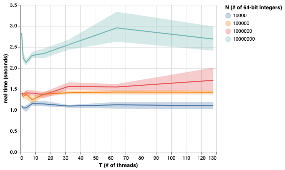
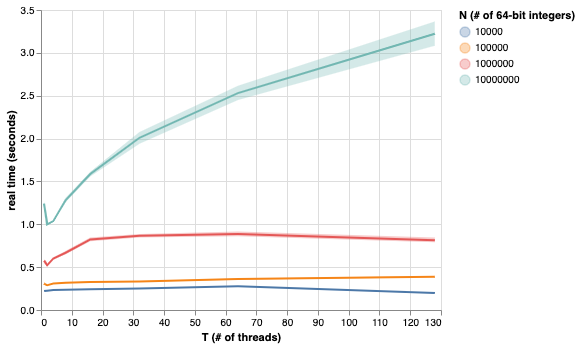
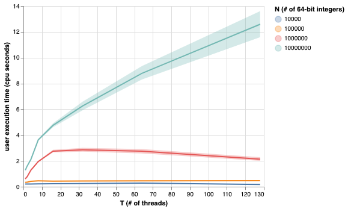
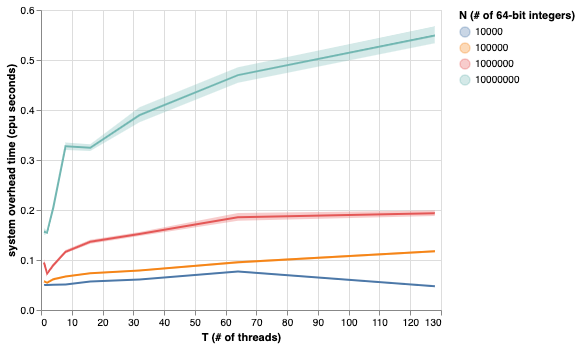
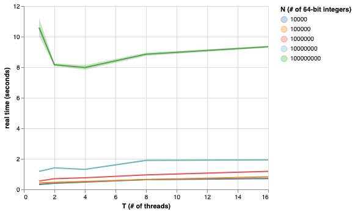
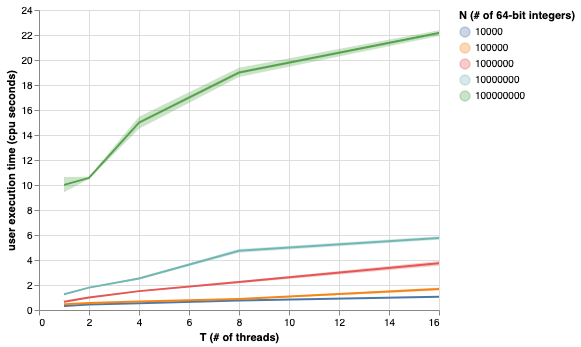
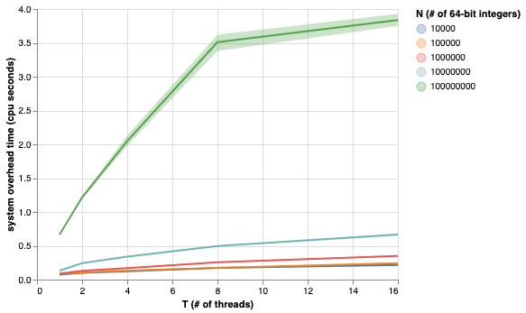
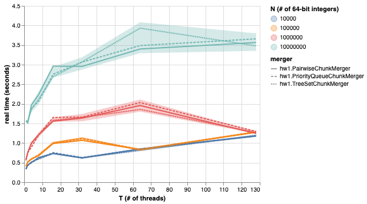
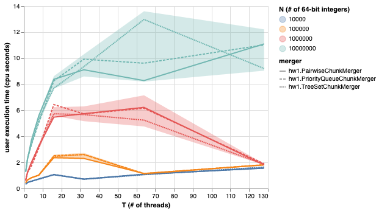
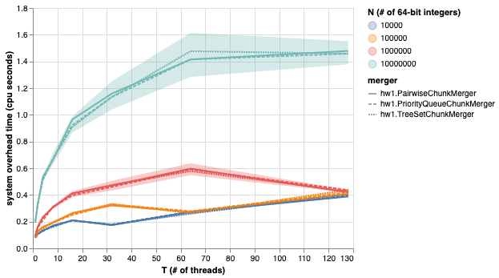

Justin Perez
# Mobile Computing (CS:4630) HW1 Discussion

[This document can be found on the public GitHub repository.](https://github.com/justin-f-perez/ParallelSort)

## Implementation

### High Level
I employ a divide-and-conquer strategy, splitting the sorting problem into independent sub-problems, by:
* slicing the input into multiple (non-overlapping) chunks
* spawning worker threads to sort each chunk independently
* joining the worker threads
* merging the (locally) sorted chunks via merge-sort

### Strategy
Spawning threads that do no work *might* fit the assignment requirements by a narrow, literal interpretation- but not in spirit. For example, in the case that there is only one chunk to be sorted among a group of three worker threads, only one of them would ever do any work. Thus, not only can chunks be sorted in parallel, but for a multi-way merge sort where the number of active threads is fixed, they must be done in parallel. Merging can also be performed in parallel if this merge-sort algorithm is applied recursively (or an iterative adaptation). 

Principles that guided the design of my program:
* The Java standard library had been optimized over decades, I had only 2 weeks (so make use of the library!)
* File I/O would be a big bottleneck
* The execution environment is undefined, so the program should be able to run in a memory-constrained environment
* Keep the concurrency model simple- prefer high level concurrency mechanisms over granular ones
* Prefer primitive data types over objects to keep memory and cpu (e.g. garbage collection) overhead lower
* Stay as close to the operating system as possible to avoid extra overhead from the JVM

### File I/O
The problem of bottlenecking on non-volatile storage I/O is non-trivial, in part because of how little is known about the target platform/hardware that this program will be evaluated on. I made an attempt to clarify some of these ambiguities, but most of my questions regarding the execution environment were left unresolved. For example:

>  For the evaluation/ranking component of the assignment…
>    * how much memory will be available to the JVM? (I’m mainly concerned with whether we can hold the input file in memory… I think the largest input is 64 * 10^8 bits, about 0.8 GB which is big enough to make me question it, **and default JVM max heap sizes vary by implementation and available memory**[emphasis added]) 
> ...
>
> -Justin Perez (email, Sep. 14, 2021)

> Don’t worry about tuning the VM. I will be using the default arguments. Yes, all the issues you mention impact performance, but we’re interested just in the average performance.
>
> -Professor Chipara (email, Sep. 15, 2021)

Without knowing how much memory I would have to work with, I could only assume that the program would need to handle inputs larger than available memory, and guess at whether I/O would be bottlenecked on a 7200RPM spinning disk or completely unencumbered by a superfast NVMe drive. I aggressively optimized my implementation for fast I/O to be safe. However, Java is encumbered by decades of backward compatible APIs- which made sifting through the documentation a daunting task for someone with no practical experience with Java.

After toiling with this I/O problem for many hours, I discovered memory mapped files. Memory mapped byte buffers map directly to virtual memory (allocated off of the Java heap). The operating system handles reading pages from the mapped regions of the file into physical memory (page cache) and evicting them from cache (writing changes back to disk) as needed. This mechanism provides the program with the benefit of a much larger memory space to work with and leverages the operating system's highly efficient read/write caching. All of my implementations creates separate memory maps for each chunk of the input file.

### Memory
I take it as a given that we shouldn't just recurse until chunk size is 8 bytes (one 64-bit long value). Contrary to popular belief among middle management at retail outlets everywhere, creating more work for your already saturated workers does not make them work faster. Instatiating objects and calling methods have cost us finite resources, both in terms of CPU cycles and memory. These memory costs may be realized on the JVM heap (risking an OOM crash for large inputs), the stack (risking stack overflow), or non-volatile storage (consuming I/O bandwidth, which is a hardware-based bottleneck on many systems). Thus, relative system overhead increases as chunk size decreases- even when the number of threads remains fixed.

#### real-time with chunk count fixed at 128


Chunk sorting is done in-memory by allocating a chunk-sized array on the heap, invoking Java's builtin Arrays.sort(), and then pushing the sorted chunk into an equivalent (in terms of position and size) chunk in a temporary (scratch space) file. This in-memory chunk sorting is why it's important that chunks be small enough we can hold as many chunks as we have threads in memory at the same time. Since file I/O can be quite slow, I assumed that threads that weren't currently executing would still have their stack/heap references held in-memory, and verified that assumption through controlled OOM crashing with various JVM `Xmx` (max heap size) and thread count values. 

I spent quite a bit of time profiling and crashing my program to find the right balance between chunk size and OOM safety, and implemented utilities to maximize chunk size and minimize chunk count. However, chunk count is always >= # of threads. Otherwise, on any JVM with >= 1 GB of memory would be able to fit the entire input into memory in one chunk, and the whole thing would just get sequentially sorted while the rest of the threads "sleep in parallel".

| threads | reserved overhead | ✅=good ❌=OOM |
| ------- | ----------------- | -------------- |
| 1       | 6 MB              | ✅             |
| 2       | 4 MB              | ❌             |
| 2       | 8 MB              | ❌             |
| 2       | 40 MB             | ❌             |
| 2       | 50 MB             | ❌             |
| 2       | 57 MB             | ❌             |
| 2       | 61 MB             | ✅             |
| 2       | 70 MB             | ✅             |
| 4       | 16 MB             | ❌             |
| 4       | 24 MB             | ❌             |
| 4       | 32 MB             | ❌             |
| 4       | 60 MB             | ❌             |
| 4       | 64 MB             | ❌             |
| 4       | 69 MB             | ❌             |
| 4       | 70 MB             | ✅             |
| 8       | 16 MB             | ❌             |
| 8       | 24 MB             | ✅             |
| 64      | 11 MB             | ✅             |
| 64      | 15 MB             | ✅             |
| 64      | 16 MB             | ✅             |
| 128     | 16 MB             | ✅             |
| 128     | 19 MB             | ✅             |
| 128     | 24 MB             | ✅             |

> so... that's pretty weird. looks like memory use peaks at 4 cores on my machine. in any case, it looks like everything should sort with 70MB of overhead. I'm going to double it for a margin of safety
>
>[GitHub PR #22](https://github.com/justin-f-perez/ParallelSort/pull/22)


### Parallelization and Safety
Parallelization is implemented through an `ExecutorService` with a fixed thread pool. `ChunkSorter`s implementing the Callable interface are instantiated and added to the pool, the pool is shutdown (indicating no new tasks will be added; this is a precondition to termination) and then the main thread awaits termination of all threads. A similar pattern follows for the merging of these chunks, with a separate thread pool being awaited for termination on each round of pair-wise merging of chunks.


Since each chunk is sorted by exactly one thread, and there are no overlaps between chunks, data races are not possible. Only after the main thread re-opens the scratch file (and remaps the chunks into memory) in addition to creating one memory map for the output file. The main thread then merges the chunks' byte buffers (which are wrapped in LongBuffers) into the output file by using a `PriorityQueue` as a min-heap (for one of several implementations of merging in the repository). The chunks themselves (i.e., `LongBuffer`s) are added to `PriorityQueue` "min-heap", which compares them by the value of the element at their current `position`. In pseudo-code:

```
let CHUNKS be the set of LongBuffers wrapping byte buffers mapped to the scratch file (each buffer is a "chunk" that is already sorted)
let OUT be the singular LongBuffer backed by a byte buffer memory mapped to the output file
let HEAP be the PriorityQueue acting as a min-heap

for CHUNK in CHUNKS:
    HEAP.add(CHUNK)
    
DO:
    CHUNK = HEAP.pop()
    OUT.put(CHUNK.get())  # side-effect: get() and put() update the `position` field of their respective buffers

    if popped_buffer has remaining elements:
        add popped_buffer to min_heap again
        
WHILE min_heap has remaining elements
```

Although this merging algorithm uses multiple memory mapped byte buffers as input, the algorithm initially only ran on the main thread. Allocating threads to the `ChunkSorter` tasks is handled by an `ExecutorService` with a fixed thread pool, with each `ChunkSorter` sorting a mutually exclusive region of the input file into a mutually exclusive region of the scratch file, and only after joining these threads is merging performed. Finally, even though I didn't think it was necessary, I had each `ChunkSorter` add a lock on the `FileChannel`s for both reading and writing, and had the main thread lock the scratch and output `FileChannel`s during merging. I removed these and replaced them with assertions to guarantee the Split objects representing the regions of the file being operated on in parallel were mutually exclusive. This strategy allowed the program to fail fast during development and debugging when assertions were enabled (via the `-ea` flag) without any runtime overhead when they disabled for performance benchmarking.

However, the above implementation wasn't fast enough to see measurable performance gains on the inputs we were required to run. In fact, the algorithm was naive enough that simply doing a single-threaded sort using Java's `Arrays.sort(long[])` proved faster than using the same method to sort two chunks of the input file and merge them. I implemented a parallelized version of the sorting program that merges chunks pair-wise in rounds using an `ExecutorService` with a fixed thread pool. This is basically just an iterative version of a recursive merge-sort where each level of the call tree is executed asynchronously and synchronized before moving up to the next level (by `await`ing termination of the thread pool).

The asynchronous parallelization of the merge algorithm didn't really help.


### Evaluation

I wrote a JupyterLab notebook using a mixture of python and shell script to invoke the sorting program for 100 iterations on each combination of parameters prescribed in the problem statement, for a total of 3200 invocations on the final run (i.e., not including invocations from debugging). The notebook is included in the git repository hosted on GitHub, which contains many technical notes, including libraries used for the notebook, dependency versions, etc. Three interactive line charts including confidence interval bands are also present in the notebook. These charts plot:
1. real/wall-clock time
2. user CPU time
3. system CPU time


#### real-time with parallel sort, sequential min-heap merge

#### user-time with parallel sort, sequential min-heap merge

#### sys-time with parallel sort, sequential min-heap merge


In general, each implementation peaked in performance at around 1-4 threads. I also found that the minimum amount of overhead I needed to leave for java on the heap peaked at 4 threads (see the table above). This likely has something to do with the fact that the M1 Macbook Pro I was evaluating the program on has four efficiency cores and four high-power cores.

It's also the case that the larger the input, the more that was gained from parallelism with my program. I expect that any number of threads beyond 8 will cause performance degradation, no matter how large the input. More than 8 threads means at least one core is being shared, which means more context switching and more overhead. I tried out some larger inputs too.

#### real-time with parallel sort, sequential min-heap merge


#### user-time with parallel sort, sequential min-heap merge


#### sys-time with parallel sort, sequential min-heap merge


### Causes of suboptimal performance
I think the biggest factor in subobtimal performance below 8 threads is the fact that I'm pitting a Java novice's merge algorithm, implemented in 2 weeks, against a sorting algorithm written by Java pros. The number of threads sets a floor on the number of chunks... more chunks => more merging => ratio of sorting done via merge rather than quicksort increases.

When the intellij async profiler did work, I noticed that a substantial amount of time, as much as ~1/3 was spent on compilation. I think this is the JIT compiler making on-the-fly optimizations. I tried to leverage this feature by writing a Pairwise`ChunkMerger` that had long, predictable (e.g., avoiding `break`) count-based loops like this (hoping the compiler would unroll the loop for some performance gains):
```java
minRemaining = Math.minimum(leftChunk.remaining(), rightChunk.remaining());
for (int i=0; i<minRemaining; i++) {
    output.put(...) 
}
```
It worked pretty well- at least performance peaked around 2-4 threads for the largest input, rather than peaking at 1 thread for all of them. Studying how the regular compiler and the JIT compiler do optimizations seems like a promising avenue for more gains. I also suspect that this is part of the reason why performance didn't scale particularly well with my parallelization implementation, the merge-sync cycle may not be as predictable to the compiler as, e.g., implementing a `ForkJoinTask` that recurses under conditions known at compile time.

#### real-time plotted with multiple merging implementations

#### user-cpu-time plotted with multiple merging implementations

#### sys-cpu-time plotted with multiple merging implementations


### Considerations for future improvements
Ultimately, it's pretty hard to tell what should be optimized for to improve real-time execution speed on my own machine. It's mostly been guess-and-check. You can't improve what you can't measure, no instruction for doing so was provided, and the Intellij async profiler crashes on large inputs (even though the program runs fine without the profiler)- one of many benefits to developing in a language that practically forces you to use an IDE, I guess.

The first thing I would do is either
1. figure out measures of scalability that aren't locked to a specific platform/target (e.g., I/O complexity, time complexity, space complexity, etc; whereas wall-clock/real time is completely dependent system configuration), or
2. set limits on what hardware/platforms my approach will support so I don't waste my time making useless optimizations. Consider three configurations:
    1. 1GB RAM/64 cores/HDD hard disk - should be optimized for space complexity
    2. 16 GB RAM/2 core/NVMe - should be optimized for time complexity
    3. 128 GB RAM/8 cores/HDD - should be optimized for I/O complexity

For the first approach, I'd rewrite in a higher level language so I can iterate on my approach faster (and avoid Java's baggage). For the second, I'd rewrite in a more performant language like C or Rust.

It could be useful to explore alternative models for "chunking". For example, we might see some improvements in I/O (in terms of page cache hits/misses) if we align chunks to page boundaries. It would also be a good idea to experiment with chunk size and ordering. For example, what if we use a task queue instead of a task pool? What's the optimal "chunk size" for balancing work between the threads (e.g., if we just have as many chunks as we do cores and one thread completes early, it can't "help" the other threads complete their chunk.)

Implementing a counting sort like bucket sort could improve parallelism

>So far, the main bottleneck is the merging of the chunks of data at the end. This is single threaded and there is a lot of cpu overhead in pushing and popping the heap. I am still working on a better solution for this. If I had to redo this, I would write a recursive function to sort the chunks, instead of sorting them seperately and combining them at the end.
-Rahsin

Try implementing a counting sort like bucket sort or radix sort

Use private memory maps instead of a temporary file for 'scratch space'

## Time Spent, and Time Wasted
### Justin
I've put around 120 hours into this project
* 20-25 hours: understanding the problem, asking clarifying questions, learning Java, setting up my dev environment, writing small practice programs, and feeling out the Java ecosystem
* 20-25 hours: writing and debugging my first attempt at an implementation using a recursive version of this algorithm using a `ForkJoinPool` (it wasn't really clear to me whether the `parallelism` parameter strictly controlled the number of threads or not, so I abandoned this strategy).
* 15+ hours wasted on group overhead: creating a GitHub repository, writing up issues, proposing a collaborative workflow, etc. on Sat Sep 18 that no one committed to until the day before the assignment was due. One of the most frustrating events was doing 80% of the project on my own with plenty of time to spare, spending **7.5 hours** making sure everything would run on one group member's computer-repair-shop-loaner Windows dev environment only for them to quit the group the next day. I was already pretty jaded about group projects, this is just another nail in the coffin.
* 30-35 hours: writing a non-recursive version of the algorithm, testing, debugging, writing the python notebook for plotting the charts, this discussion document, etc.
* 20-25 hours parallelizing and implementing variations of `ChunkMerger`

I've learned:
* a lot about Java- I haven't touched it since the late 2000's. I'd forgotten pretty much all of it, and a lot has changed.
* the history of file I/O in Java (is every Java programmer a historian?)
* a new plotting library I'd never used before, Altair. It worked pretty great! I'd say it was easier to get going with than matplotlib or seaborn (two other graphical plotting packages for python).
* how the operating system page cache works (not at a very detailed level, but much more than I knew before this project.)
* divide and conquer is an effective strategy for implementing parallelism while avoiding many headaches involved with concurrency
* what data races are, how they occur, and how to use concurrency mechanisms to avoid them- in particular, I wasn't aware how much re-arranging the OS can do for instruction execution.
* modeling/implementing out-of-core (external) sorting algorithms
* that memory mapping exists, and how it works

### Rahsin:

I've put around 20 hours so far into this project. Most of it was over the last weekend.
* 5-6 hours: Studying Java because I haven't used it in a long time and there was a lot to learn.
* 5-6 hours: Understanding Justin's existing implementation and how everything works together. 
* 5-6 hours: Trying to make the final merge parallel or at least more efficient. All my attempts slower than just running Arrays.parallelSort on the whole thing.
* 1-2 hours: Implementing an alternative argument to just run Arrays.parallelSort on the whole chunk instead of breaking up and merging the main file.

I've learned:
* Java. I haven't used it in 5 years. I've been spoiled from mostly coding in Javascript and Python in the past few years.
* Java's in built functions are pretty efficient and if this was not an assignment I would just use them isntead.
* Concurrency and how much I would rather not have to directly deal with it.
